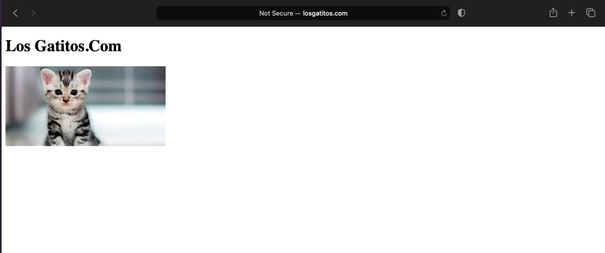

# Workshop 02

# Creacion de una Aplicacion LAMP

## Aplicaciones de Software Libre a Utilizar

- `Linux:` SO
- `Apache` Servidor de Aplicaciones
- `MariaDB:` BD
- `PHP:` Lenguaje de Programacion

## Cambiar nombre al Host y Realizar las Respectivas Configuraciones

- `sudo hostnamectl set-hostname webserver:` comando para cambiar el nombre de la maquina virtual
- `sudo nano /etc/hosts` para editar el archivo para que se conozca la misma maquina, en esa ruta se encuentra el archivo el cual debemos modificar
- `sudo apt-get update:` lo utilizamos para actualizar la lista de paquetes elegibles
- `sudo apt-get install vim vim-nox curl apache2 mariadb-server mariadb-client php8.2 php8.2-curl php8.2-bcmath php8.2-mysql php8.2-mcrypt php8.2-xml php8.2-zip php8.2-mbstring:` este comando lo utilizamos para realizar la instalacion de las aplicaciones que vamos a utilizar
- `sudo nano /etc/hosts:` este comando lo utilizo para editar el archivo del host de la maquina
- `192.168.56.199  randycorea.isw811.xyz:` esta linea la agregamos en el archivo hosts de la maquina anfitriona para similiar el dominio que queremos utilizar, esto lo podemos probar con realizar un ping a dicho dominio para probar su funcionamiento.
- Realizamos una prueba ingresando desde el navegador en una venta en incognito a cualquiera de los dos dominios que tenemos configuradas
- `sudo a2enmod vhost_alias rewrite:` Habilitacion el modulo necesario para activar el proxy reverso de apache 
- `sudo systemctl restart apache2:` este comando realiza el reinicio del servicio de apache para aplicar los cambios que ya aplicamos
- `cd /vagrant/:` para irnos a la raiz de vagrant, aca podemos ver que todo lo que pongamos en la maquina anfitriona la podemos observar tambien desde el servidor
- `mkdir sites:` lo utilizamos para crear esa carpeta
- `config.vm.synced_folder "sites/", "/home/vagrant/sites", owner: "www-data", group: "www=data":` creamos la carpeta sites dos veces pero con permisos diferentes
- `mkdir confs:` para crear la carpeta donde van a estar los archivos de configuracion de las paginas que vamos a tener alojadas
- `confs % touch losgatitos.com.conf:` para crear el archivo de configuracion de las paginas que vamos a tener almacenadas
- `sudo cp losgatitos.com.conf /etc/apache2/sites-available/ :` copiamos el archivo para poder habilitar el sitio
- `sudo a2ensite losgatitos.com :` este comando es para habilitar el sitio
- `sudo apache2ctl -t:` para verificar que todo este ok
- `systemctl reload apache2:` lo utilizamos para reiniciar el servicio de apache

## Prueba de la Finalizacion de la Publicacion de la Pagina Web

