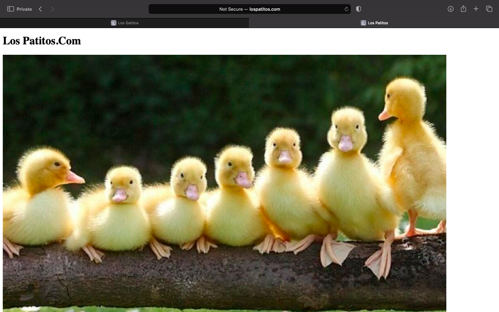

# Workshop 03 - Publicacion de los Patitos.com

## Realizar las Respectivas Configuraciones

- `sudo nano /etc/hosts:` este comando lo utilizo para editar el archivo del host de la maquina
- `192.168.56.199  lospatitos.com :` esta linea la agregamos en el archivo hosts de la maquina anfitriona para similiar el dominio que queremos utilizar, esto lo podemos probar con realizar un ping a dicho dominio para probar su funcionamiento.
- Realizamos una prueba ingresando desde el navegador en una venta en incognito a cualquiera de los dos dominios que tenemos configuradas
- `cd /vagrant/:` para irnos a la raiz de vagrant, aca podemos ver que todo lo que pongamos en la maquina anfitriona la podemos observar tambien desde el servidor
- `touch lospatitos.com.conf:` para crear el archivo de configuracion de las paginas que vamos a tener almacenadas
- `sudo cp lospatitos.com.conf /etc/apache2/sites-available/ :` copiamos el archivo para poder habilitar el sitio
- `sudo a2ensite lospatitos.com :` este comando es para habilitar el sitio
- `sudo apache2ctl -t:` para verificar que todo este ok
- `systemctl reload apache2:` lo utilizamos para reiniciar el servicio de apache

## Prueba de la Finalizacion de la Publicacion de la Pagina Web

