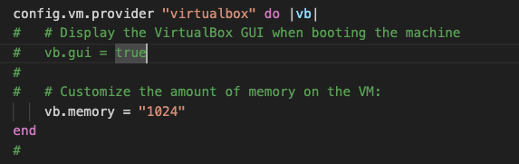
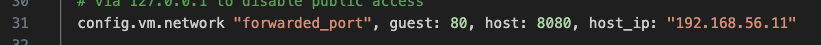
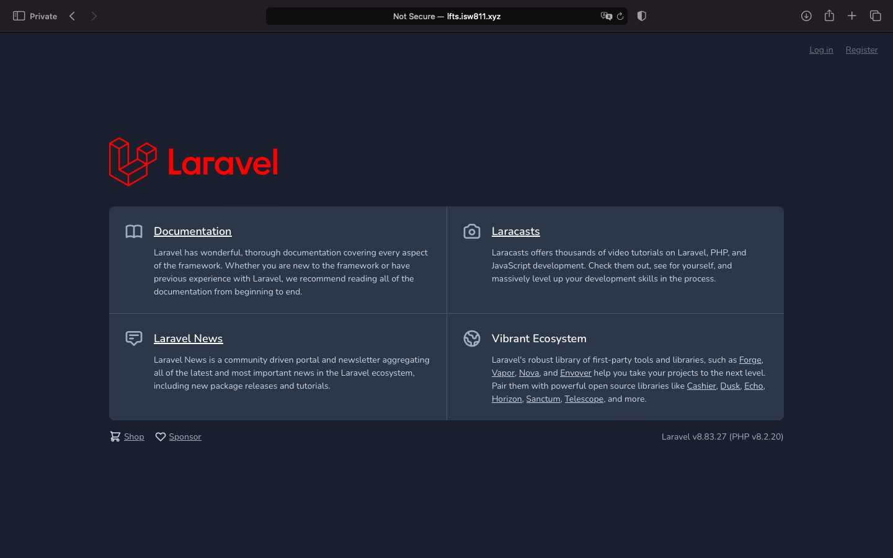
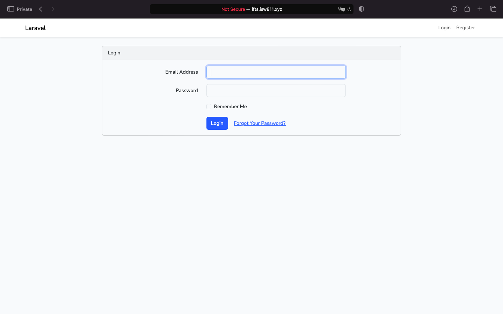
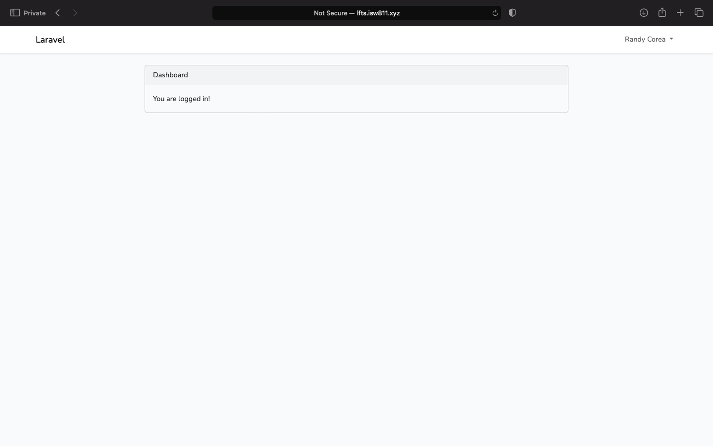
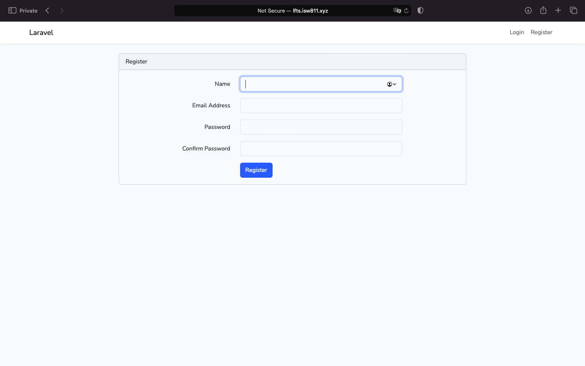

# Workshop 04

## Realizar las Respectivas Configuraciones

- `sudo nano /etc/hosts:` este comando lo utilizo para editar el archivo del host de la maquina
- `192.168.56.199  lfts.isw811.xyz :` esta linea la agregamos en el archivo hosts de la maquina anfitriona para similiar el dominio que queremos utilizar, esto lo podemos probar con realizar un ping a dicho dominio para probar su funcionamiento.
- Realizamos una prueba ingresando desde el navegador en una venta en incognito a cualquiera de los dos dominios que tenemos configuradas
- `cd /vagrant/:` para irnos a la raiz de vagrant, aca podemos ver que todo lo que pongamos en la maquina anfitriona la podemos observar tambien desde el servidor
- `touch lfts.isw811.xyz.conf:` para crear el archivo de configuracion de las paginas que vamos a tener almacenadas
- `sudo cp lfts.isw811.xyz.conf /etc/apache2/sites-available/ :` copiamos el archivo para poder habilitar el sitio
- `sudo a2ensite lfts.isw811.xyz :` este comando es para habilitar el sitio
- `sudo apache2ctl -t:` para verificar que todo este ok
- `systemctl reload apache2:` lo utilizamos para reiniciar el servicio de apache

## Laravael 

- `php -v :` comando para verificar la version de PHP
- `php -r "copy('https://getcomposer.org/installer', 'composer-setup.php');"`
- `php -r "if (hash_file('sha384', 'composer-setup.php') === - 'dac665fdc30fdd8ec78b38b9800061b4150413ff2e3b6f88543c636f7cd84f6db9189d43a81e5503cda447da73c7e5b6') { echo 'Installer verified'; } else { echo 'Installer corrupt'; unlink('composer-setup.php'); } echo PHP_EOL;"`
- `php composer-setup.php`
- `php -r "unlink('composer-setup.php');"`:comandos para descargar composer
- `./composer.phar :` para ejecutar el composer en el directorio actual
- `echo $PATH :` contenido de la variable de entorno PATH
- `sudo mkdir -p /opt/composer: ` crear carpeta
- `sudo mv composer.phar /opt/composer :` mover el binario a la carpeta anteriormente creada
- `sudo ln -s /opt/composer/composer.phar /usr/local/bin/composer :` crear lanzador
- `composer create-project laravel/laravel:8.6.12 lfts.isw811.xyz :` comando para crear el projecto de laravel 

## Aprovisionamiento de BD 

- randycorea@Randys-MacBook-Air VMs % mkdir database
- randycorea@Randys-MacBook-Air database % vagrant init debian/bookworm64

## Personalizacion de IP y Memoria RAM

- `randycorea@Randys-MacBook-Air database % vagrant ssh :` iniciar maquina
- `vagrant@bookworm:~$ sudo hostnamectl set-hostname database :` para cambiar el nombre de bookworm a database
- `vagrant@bookworm:~$ sudo nano /etc/hosts :` para ingresar al archivo de hosts y cambiar el nombre a database
- `vagrant@database:~$ sudo apt-get update :` para actualizar la lista de paquetes necesarios
- `vagrant@database:~$ sudo apt-get install vim vim-nox mariadb-server mariadb-client :` instalacion de MariaDB
- `vagrant@webserver:~$ sudo apt-get remove mariadb :` para remover el mariadb del webserver y tenerlo por separado
- `vagrant@webserver:~$ sudo apt-get autoremove :` para autoremover paquetes no necesarios
- `vagrant@database:~$ sudo mysql :` para entrar a la configuracion de la BD
- `MariaDB [(none)]> show databases; :` para ver las bases de datos ya preinstaladas
- `MariaDB [(none)]> create user laravel identified by 'secret'; :` para crear el usuario
- `MariaDB [(none)]> create database lfts; :` para crear la database
- `MariaDB [(none)]> grant all privileges on lfts.* to laravel; :` para darle permisos al usuario laravel en la bd de lfts
- `MariaDB [(none)]> show grants for laravel; :` para verificar los permisos dados al usuario
- `MariaDB [(none)]> flush privileges; :` para refrescar los permisos dados de una vez
- `MariaDB [(none)]> quit :` para salir
- `vagrant@database:~$ mysql -u laravel -p :` para ingresar de forma interactiva
- `vagrant@database:~$ sudo nano /etc/mysql/mariadb.conf.d/50-server.cnf :` deshabilitar el archivo que bloquea las conexiones remotas
- `vagrant@database:~$ sudo systemctl restart mysql :` reiniciar el servicio
- `vagrant@webserver:~$ mysql -h 192.168.56.11  -u laravel -p :` para ingresar a la BD desde el WebServer 
- `wget -qO- https://raw.githubusercontent.com/nvm-sh/nvm/v0.40.1/install.sh | bash :` para instalar nvm gestor de versiones de node
- `vagrant@webserver:~$ source ~/.bashrc :` para anadir a las variables de  entorno
- `vagrant@webserver:~$ nvm :` para verificar si ya tenemos instalados nvm
- `vagrant@webserver:~$ nvm ls-remote :` para ver todas las versiones que tenemos disponibles
- `vagrant@webserver:~$ nvm install --lts=Hydrogen :` instalar la version que vamos a utilizar
- `vagrant@webserver:~$ npm -v :` para verificar la version instalada de npm
- `vagrant@webserver:~$ node -v :` para verificar la version instalada de node
- `vagrant@webserver:/vagrant/sites/lfts.isw811.xyz$ composer require laravel/ui:3.4.6 :` para descargar laravel/ui:3.4.6
- `vagrant@webserver:/vagrant/sites/lfts.isw811.xyz$ php artisan ui boostrap :` 
- `vagrant@webserver:/vagrant/sites/lfts.isw811.xyz$ npm install && npm run dev :`
- `nvm use lts/hydrogen  nvm alias default lts/hydrogen : `
- `vagrant@webserver:/vagrant/sites/lfts.isw811.xyz$ php artisan ui bootstrap --auth`

## Evidencias Correspondientes

